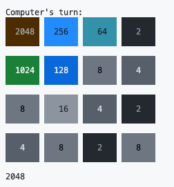

# AI Player of the Game 2048



## Introduction

This is an AI player of the game 2048. The AI player uses the expectiminimax algorithm with alpha-beta pruning and iterative deepening search to find the best move. The AI player also uses heuristics to evaluate the utility of a state.

## Expectiminimax

Expectiminimax is a variant of the minimax algorithm that is used for games with chance nodes. In the game 2048, the chance node is the tile that appears after each move. The expectiminimax algorithm is used to find the best move for the AI player.

## Alpha-Beta Pruning

Alpha-beta pruning is a technique used to reduce the number of nodes that are evaluated by the minimax algorithm in the search tree. The alpha-beta pruning algorithm is used to reduce the number of nodes that are evaluated by the expectiminimax algorithm in the search tree.

## Iterative Deepening Search

Iterative deepening search is a technique used to find the best move within a limited amount of time. The iterative deepening search algorithm is used to find the best move within 0.1 seconds.

## Heuristics

`monotonicity - smoothness + weighted_sum + max_corner`

- **Monotonicity**: The values of the tiles are monotonically increasing along a row or column. This heuristic is based on the observation that the best strategy is to keep the largest tile in a corner and to keep the next largest tiles adjacent to it.

- **Smoothness**: The values of the tiles are smooth along a row or column. This heuristic is based on the observation that the best strategy is to keep the tiles in a row or column as close as possible.

- **Weighted Sum**: The values of the tiles are weighted by a predefined matrix. This heuristic is based on the observation that the best strategy is to keep the largest tiles in the corners and the next largest tiles adjacent to them.

- **Max Corner**: The largest tile is in the top left corner. This heuristic is based on the observation that the best strategy is to keep the largest tile in a corner and to keep the next largest tiles adjacent to it.

## Usage

To run the AI player, run the following command:

```
python GameManager.py
```

The AI player will play the game automatically. The game will end when the AI player reaches 2048 or when the AI player loses.
